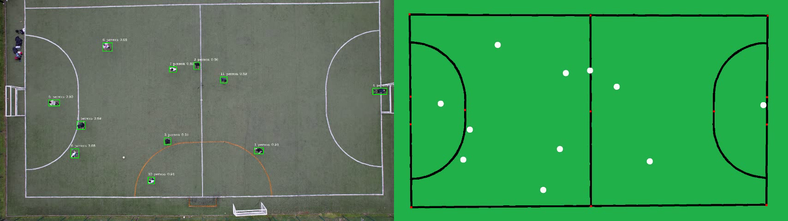

# Trabajo de Título: Rastreo de acciones en partidos de fútbol

**Autores:** Matías Sepúlveda y Matías Millacura

Este proyecto consiste en el desarrollo de un sistema para rastrear acciones en partidos de fútbol. El sistema utiliza la tecnología YOLOv8 para identificar y trackear a los jugadores y el balón en el video. Una vez que los jugadores y el balón han sido identificados, el sistema podrá calcular diferentes métricas importantes.

